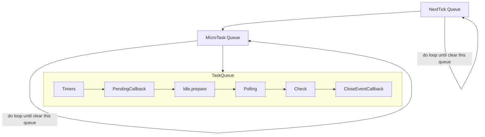

## Event Loop 的 Queue

- ### NextTick Queue
  - <mark>優先級第一高的Queue．</mark>
  - 所有給定的<mark>process.nextTick(CALLBACK)</mark> 的Callback都會放置在此Queue中．
- ### MicroTask Queue
  - <mark>優先級第二高的Queue．</mark>
  - 當程式中使用 Promise的狀態由pending轉為resolve/reject時，resolve/reject內的callback會排到這個Queue等待執行中
    - ex: Promise(function(resolve,reject){}).then(<mark>CALLBACK</mark>)
    - ps: Promise(<mark>FUNCTION</mark>).then(CALLBACK) 中的 FUNCTION 是同步的
- ### Task Queue
  - #### Timers
    - setTimeout 
      - 延遲Ｎ時間後，執行一次
    - setInterval
      - 重複（延遲Ｎ時間後執行）
  - #### Pending Callback
    - OS System level
    - ex : tcp <mark>ECONNREFUSED</mark> callback event
  - #### Idle, Prepare
    - 內部使用
  - #### Polling
    - stream input callback event
    - ex: .on('data',function)
  - #### Check
    - setImmediate
  - #### Close Callback
    - 關閉連線,關閉檔案等...操作時, 只要有關<mark>關閉</mark>的動作的callback
    - ex: socket.on('close',<mark>FUNCTION</mark>)

## NodeJS 解讀順序
- 1. 直譯式語言，整份程式碼會先跑一遍，遇到Sync function會直接處理．
- 2. 遇到async function 就註冊事件到queue中
  - ex: setTimeout() 註冊到Timers中
- 3. 當整份程式碼掃完以後，就會去EventLoop循環．只要有註冊的事件(Callback)還未完成，就會一直循環
- 4. 當循環得過程中，只要是發現nextTick / microTask的Queue中有還未完成的事件(Callback)，就會優先把該Queue中的事件完成. 再返回原本離開的EventLoop中繼續執行

## Test Code
```javascript
console.log('start')

process.nextTick(function(){
    console.log('nextTicket')
})

setTimeout(function (){
   console.log('setTimeout') 
},0)

new Promise(function (resolve,reject){
    console.log('promise');
    resolve('resolve')
}).then(function (data){
    console.log('promise then:' + data)
});

(async function(){
    console.log('async')
})();

setImmediate(function (){
    console.log('setImmedidate')
})

process.nextTick(function (){
    console.log('nextTick2')
})

console.log('end')
```

```
> start
> promise
> async
> end
> nextTick
> nextTick2
> promise then resolve
> setTimeout
> setImmedidate
```
